theme: work, 3
theme: work, 3
slidenumber: true
autoscale: true

[.slidenumber: false]
# [fit] **Recommendation Systems**
# *Using Deep Learning Techniques*

*9th & 10th Sept 2019*
*Workshop Notes*

AI Conference 2019
San Jose, CA

 

[Amit](https://amitkaps.com) & [Bargava](https://bargava.com)

---

# **Agenda - Day 1**

- **Workshop Introduction**
- **#1: Recommendation Framework**
- **#2: Deep Learning Basics**
- **#3: Collaborative Filtering**
- **#4: Content Based**
- **#5: Learning to Rank**
- **Recap + Q&A**

---

# **Agenda - Day 2**

- **Introduction + Q&A**
- **#5: Learning to Rank (contd.)**
- **#6: Hybrid Recommender**
- **#7: Time & Context**
- **#8: Deployment & Monitoring**
- **#9: Evaluation & Challenges**
- **Recap & Way Forward**

---

# **Session Plan**

- 0930 - 1030: *Session #1*
- 1030 - 1100: Morning Break
- 1100 - 1230: *Session #2*
- 1230 - 1330: Lunch
- 1330 - 1500: *Session #3*
- 1500 - 1530: Afternoon Break
- 1530 - 1700: *Session #4*

---

# **RecSys Process**

- **Why**: Define (Business Problem)
- **What**: Frame (User-Item-Interaction)
- **How**: 
    - Data: Acquire, Refine, Transform
    - Visual Explore
    - Model: Build, Evaluate, Tune and Select
- **So What**: Show & Serve 
- **So Why**: Measure, Test, Improve

---

# **Why** Recommendations
- Type of Companies (Subscription, Ad-Supported, Marketplace, Company Site, Community)
- RecSys objectives: Revenue or Margin based
    - **New**: Discovery, Sign-ups
    - **Convert**: Trial to Conversion
    - **Retain**: Reduce Churn, Up-sell, Discovery

---

---

# **What** Recommendations

- Inputs
    - Users vs. Items
    - Interaction
    - User & Item Features
- Outputs
    - User & Item Representation
    - Prediction Function
    - Ranking Function

---

---

---

# **Users vs. Items**

**Users**
A user is the *active* party, receiving and acting on the recommendations.
(Can be the context, not an actual person!)

**Items**
An item is the *passive* party that is being recommended to the users.

---

# **Interaction Actions: Positive vs. Negative**

**Positive**
Favourites, likes, stars, watches, shares, follows, bids, purchases, reads, views, upvotes...

**Negative**
Downvote, skip, 1-star reviews, rejections, unfollows, returns, downvotes...

---

# **Interaction Types: Explicit vs Implicit**

**Explicit** 
Actions that a *user expects or intends* to impact their personalized experience.

**Implicit** 
*All other actions* observed as interactions between users and items.

---

# **Interaction Scope: Point vs Temporal**
  
**Point** interaction consolidate all the interaction between a user and item into a single number e.g. Rating info

**Longitudinal** interactions retain the history of interaction over timestamps e.g. Session-based

---

# **User & Item Features: Indicator**
  
**Indicator Features**
- Feature unique to every user/item to allow for direct personalization.
- Allow to learn about every user individually without being diluted through metadata.
- Often one-hot encoded user IDs or just an identity matrix.

---

# **User & Item Features: Metadata**

**Metadata Features**
- Types of features
    - **Continuous or Categorical**: Age, location, language, device, watch time, ...
    - **Sequence-based**: tags, labels, word counts, audios
    - **Image or Video Based**: posters, videos, trailers, ...
    - **Graph-based**: knowledge base about items
- Every element about user/item before training can be a feature (if properly structured)
- Often called *“side input”* or *“shared features.”*

---

# **How** Recommendations
- Traditional Approaches
    - Top-N (Popularity based Similarity)
    - Similar Items (Content Based Similarity)
    - Frequent Item Set (Transaction Based Similarity)
    - Personalisation (User Based Similarity)
    - Collaborative Filters (Latent Features)
- Deep Learning Based Approaches

---

---

---

---

---

---

---

---

---

---

---

---

# **DL Collaborative Filtering**

- Concepts: Python DS, DL basics, Matrix Factorisation & Embeddings
- Build: Five models with DL
    - Matrix Factorisation
    - Matrix Factorisation with Bias
    - Non-Negative Matrix Factorisation
    - Deep Matrix Factorisation
    - Neural Collaborative Filtering

---

# **Data Preparation**

- Data Preprocessing
    - Index Users (Label Encoding)
    - Index Items (Label Encoding)
    - Ratings: Explicit or Implict
- Data Splitting
    - Random
    - StratifiedL User or Item based
    - Chronological: time-based

---

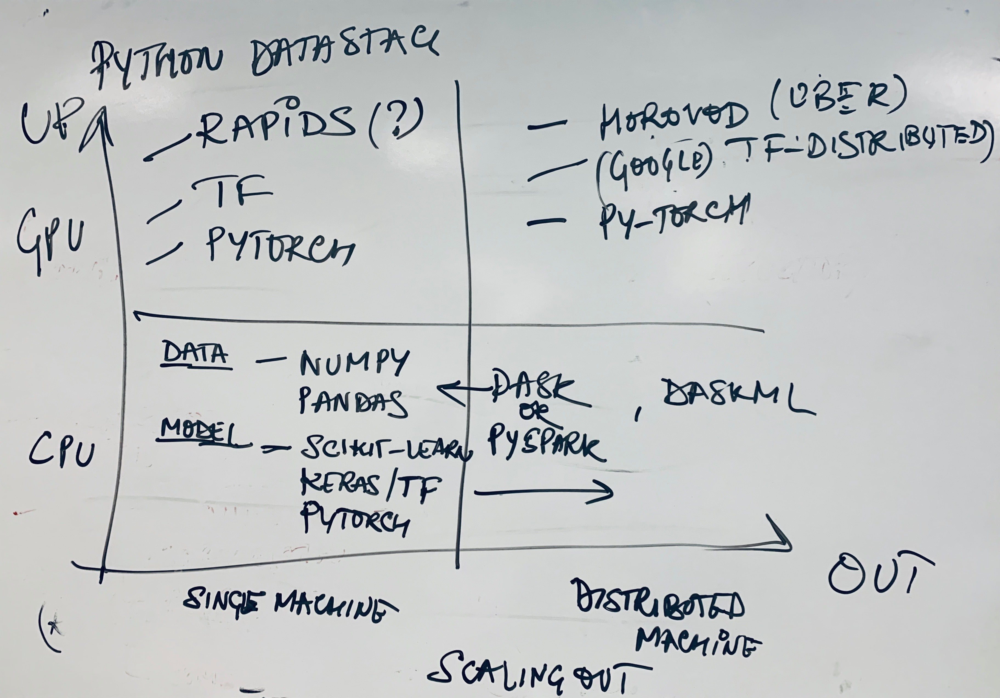

---

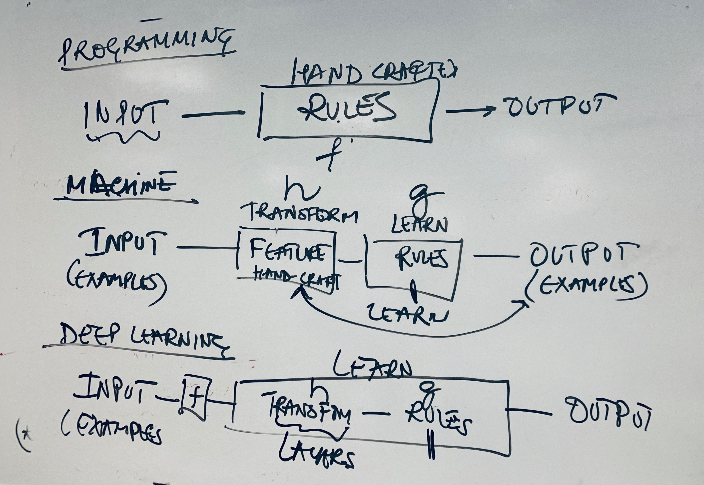

---

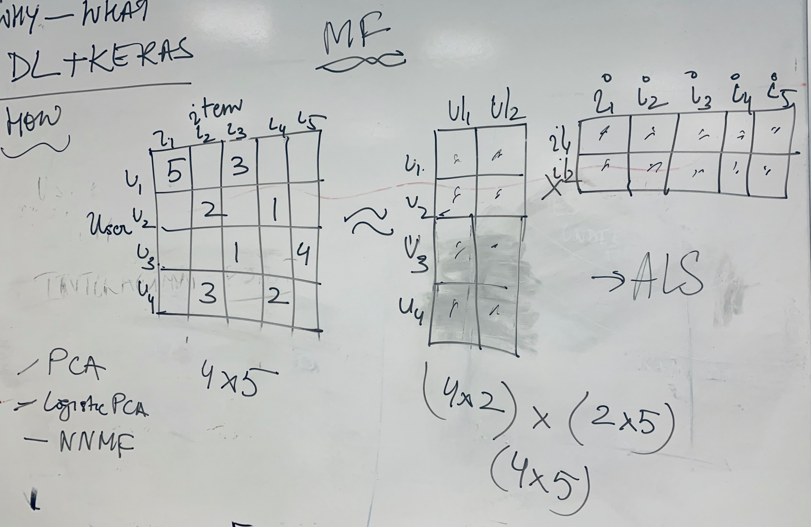

---

---

# **Content Based Recommenders**
  
- **Concept – Embedding:** Learning the representation for items
    - Exemplar: Pandora: 400 features for each song
    - Item Metadata: Continuous, Categorical, Text , Video, Image, Sound => Heterogeneous data
    - Distance Metrics: Dot product, Cosine, Euclidean
- **Build**: Three models for evaluation
    - Baseline: Popularity Based
    - Categorical + Sparse Embedding (Text)
    - Categorical + Dense Embedding (Pre-trained W2V)

---

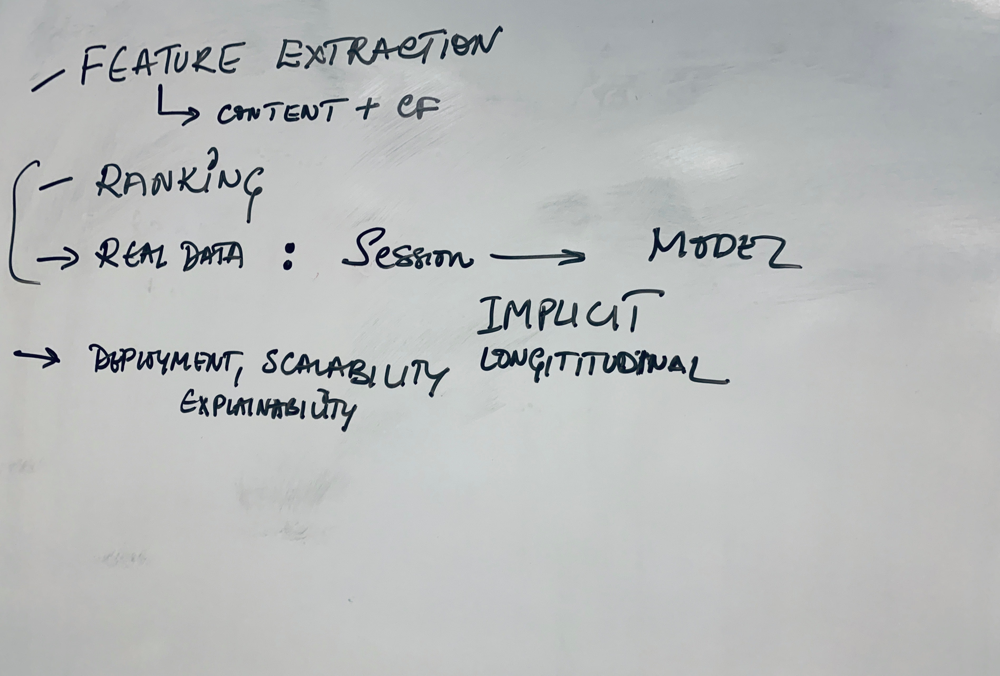

---

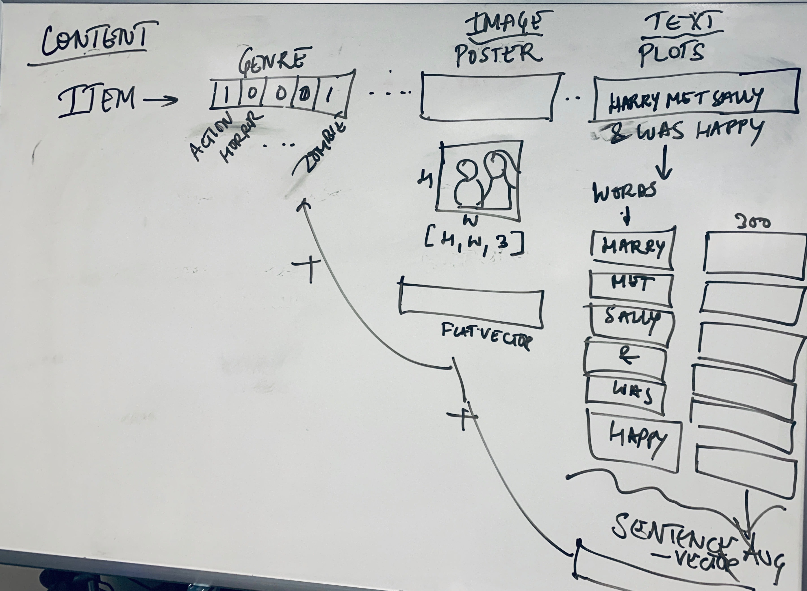

---

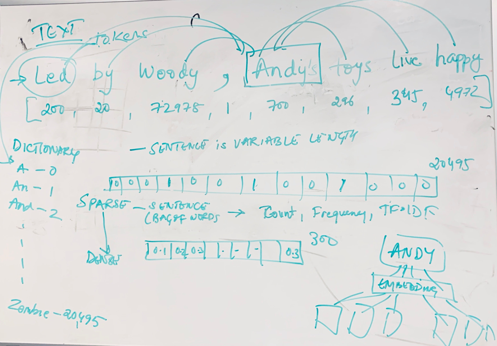

---

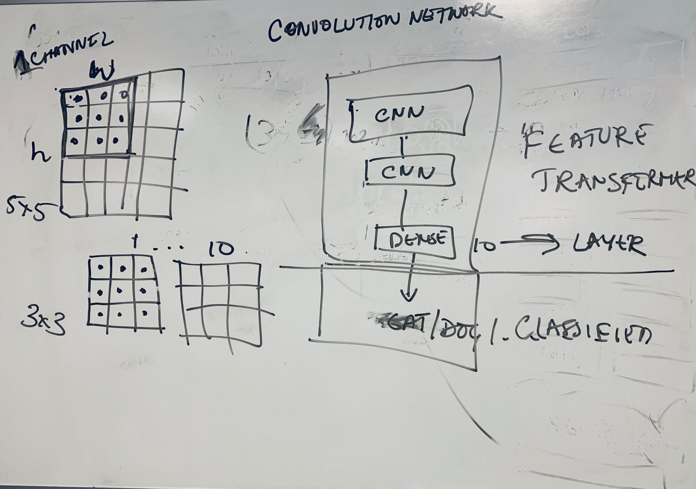

---

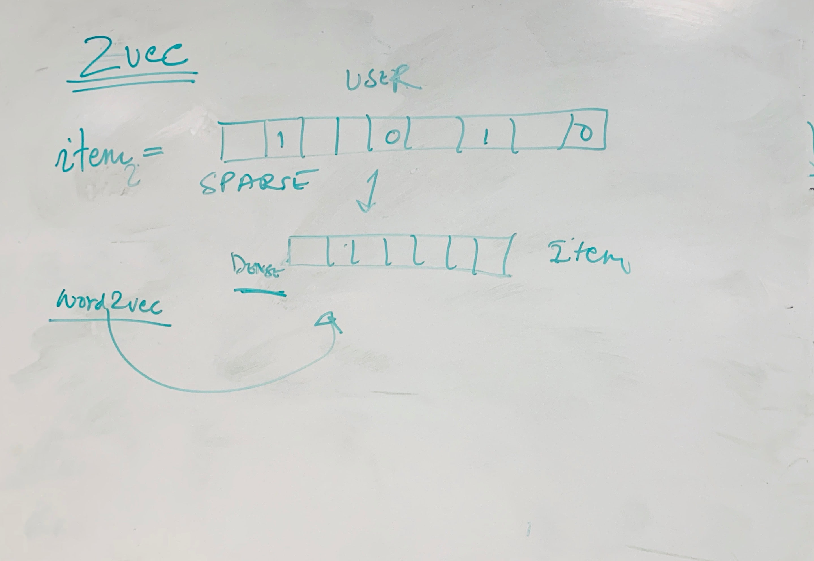

---

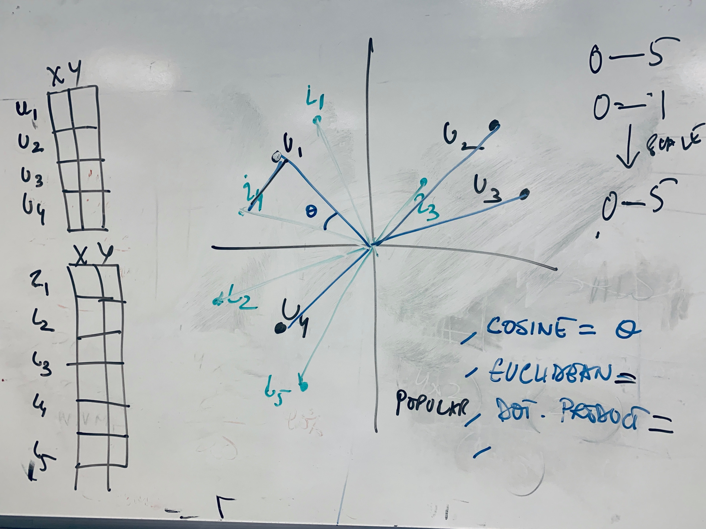

---

# **Learning to Rank**
- Ranking vs. Rating
- Candidate Generation -> Ranking -> Re-ranking
- Complexity (High number of combinations)
- Point vs. Pair vs Triplet vs. List
- Loss: BPR, WARP
- Evaluation: MAP@k, NDCG@k 
- Models:
    - Point Based (Explicit vs. Implicit)
    - Sequence Based

---

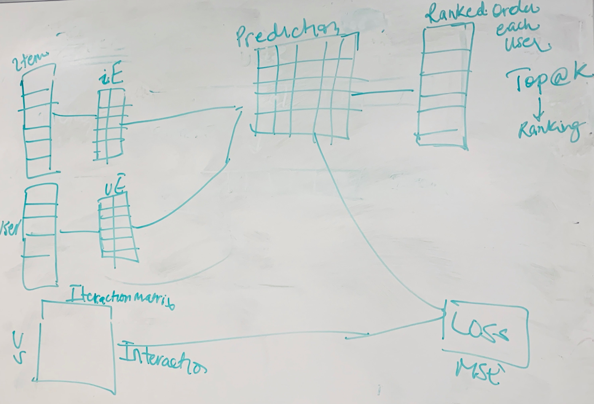

---

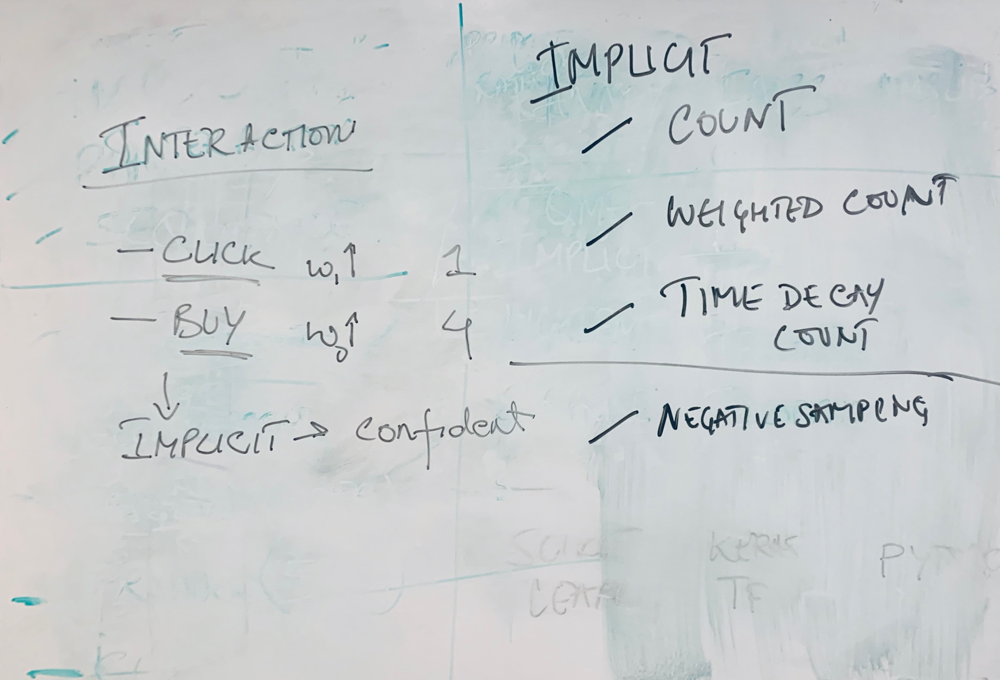

---

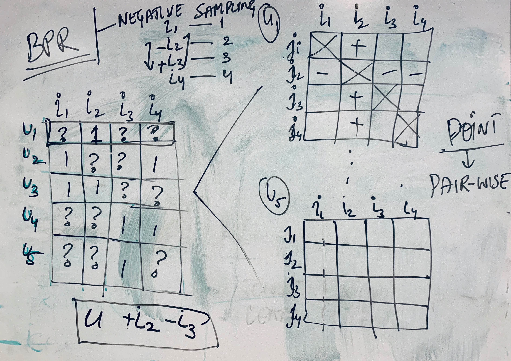

 ---

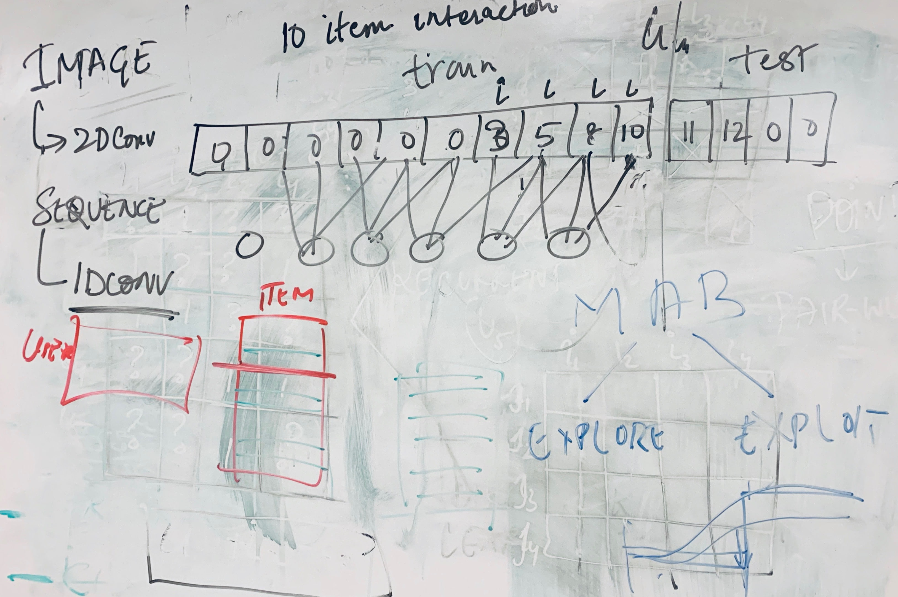

 ---
 
 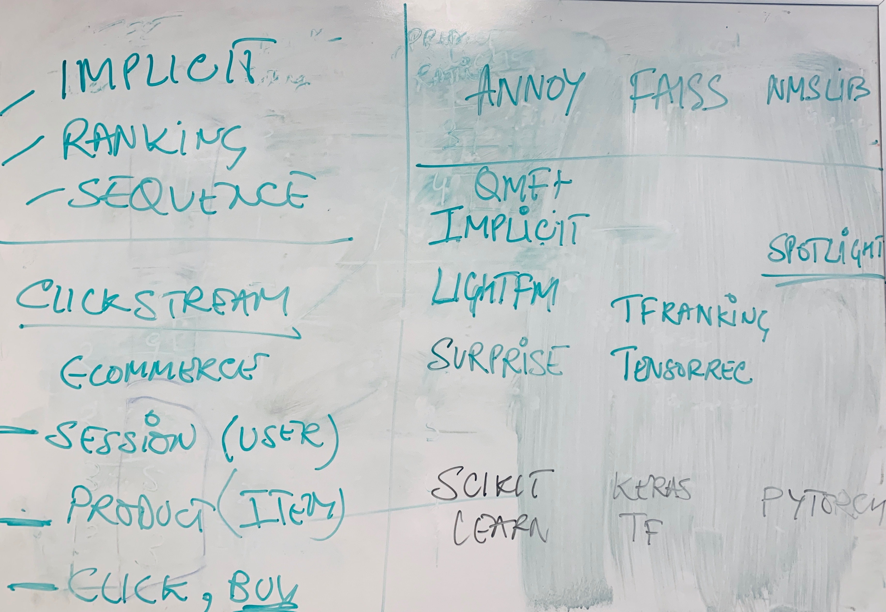

 