theme: work, 3
slidenumber: true
autoscale: true

[.slidenumber: false]
# [fit] **Recommendation Systems**
# *Using Machine Learning & Deep Learning Techniques*

*9th & 10th Sept 2019*

 
AI Conference 2019
San Jose, CA

 

[Amit](https://amitkaps.com) & [Bargava](https://bargava.com)

---

# **Agenda - Day 1**

- **Workshop Introduction**
- **#1: Recommendation Framework**
- **#2: Deep Learning Basics**
- **#3: Collaborative Filtering**
- **#4: Content Based**
- **#5: Learning to Rank**
- **Recap + Q&A**

---

# **Agenda - Day 2**

- **Introduction + Q&A**
- **#5: Learning to Rank (contd.)**
- **#6: Hybrid Recommender**
- **#7: Time & Context**
- **#8: Deployment & Monitoring**
- **#9: Evaluation & Challenges**
- **Recap & Way Forward**

---

# **Session Plan**

- 0930 - 1030: *Session #1*
- 1030 - 1100: Morning Break
- 1100 - 1230: *Session #2*
- 1230 - 1330: Lunch
- 1330 - 1500: *Session #3*
- 1500 - 1530: Afternoon Break
- 1530 - 1700: *Session #4*

---

# **Introduction**

---

# **Workshop Introduction: Day One**
- **Objectives:** Context, learning outcomes
- **Intros:** Participant & facilitator introductions
- **Context:**: Purpose & role of Recommendation
- **Expectations**: Alignment & discussion 
- **Approach**: Conceptual & exercise based 
- **Checkin**: Python setup and installation readiness

---

# [fit] **#1 Recommender Framework**

---

# **Pervasive Everywhere**

> “Once you see it, you see if everywhere”

---

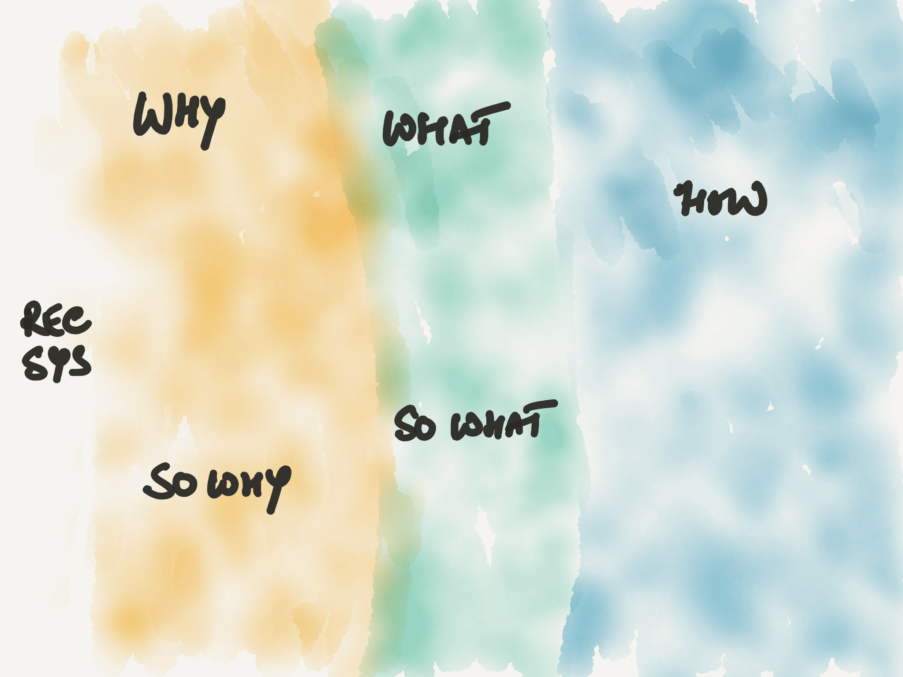

---

# **RecSys Process**

- **Why**: Define (Business Problem)
- **What**: Frame (User-Item-Interaction)
- **How**: 
    - Data: Acquire, Refine, Transform
    - Visual Explore
    - Model: Build, Evaluate, Tune and Select
- **So What**: Show & Serve 
- **So Why**: Measure, Test, Improve

---

# **Why** Recommendations?

---

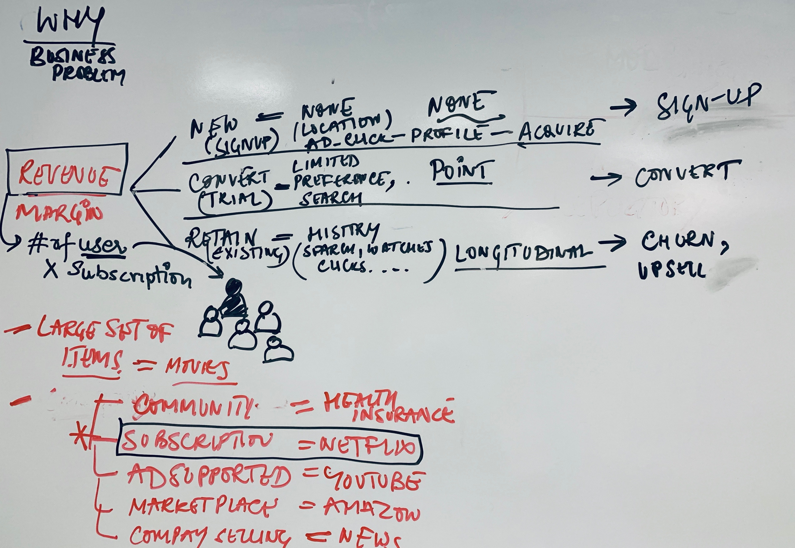

---

# **Type of Companies** 

- B2C Subscription Based (Netflix, Spotify)
- B2C Ad-Based Based (News, App Stores, Youtube)
- B2C / B2B Product/Service Marketplace (Amazon, Shopify)
- B2B Company Website (Content Marketing)
- ...

---

# **RecSys Why**

**Revenue Objectives:** e.g. subscription-based
- **New**: Get new sign-ups
- **Convert**: Convert from trial to subscription
- **Retain**: Reduce churn, Up-sell subscription
   
---

# **What** Recommendations?

---

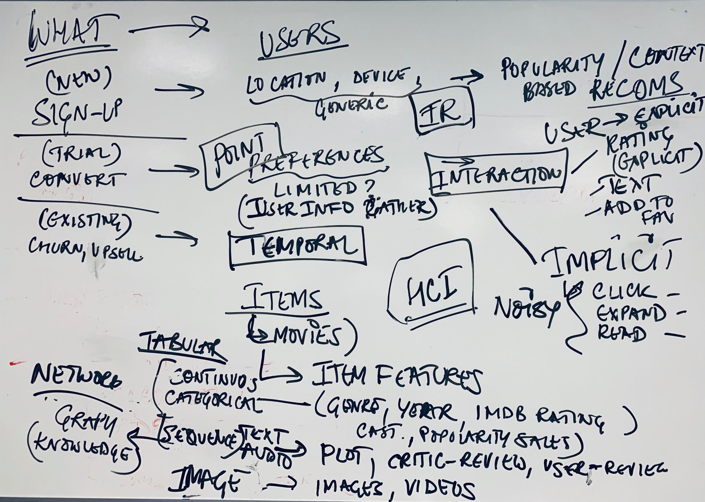

---

# **RecSys What**

- **New**: Very limited user information (Location, Device, Acquisition channel)
- **Convert**: User profile information & initial interaction with Items (Point)
- **Retain**: User profile information & long-term User Interaction (Longitudinal)
   
---

# **How** Recommendations?

---

# **Learnings from Three Disciplines**

- Information Retrieval (traditional search)
- Machine Learning (model-based)
- Human Computer Interaction (impact of presenting items to user, and the resulting interaction)

---

# **Recsys: Basic Building Blocks**

- Inputs
    - Users vs. Items
    - Interaction
    - User & Item Features
- Outputs
    - User & Item Representation
    - Prediction Function
    - Ranking Function

---

# **Users vs. Items**

**Users**
A user is the *active* party, receiving and acting on the recommendations.
(Can be the context, not an actual person!)

**Items**
An item is the *passive* party that is being recommended to the users.

---

# **Interaction Actions: Positive vs. Negative**

**Positive**
Favourites, likes, stars, watches, shares, follows, bids, purchases, reads, views, upvotes...

**Negative**
Downvote, skip, 1-star reviews, rejections, unfollows, returns, downvotes...

---

# **Interaction Types: Explicit vs Implicit**

**Explicit** 
Actions that a *user expects or intends* to impact their personalized experience.

**Implicit** 
*All other actions* observed as interactions between users and items.

---

# **Interaction Scope: Point vs Temporal**
  
**Point** interaction consolidate all the interaction between a user and item into a single number e.g. Rating info

**Longitudinal** interactions retain the history of interaction over timestamps e.g. Session-based

---

# **User & Item Features: Indicator**
  
**Indicator Features**
- Feature unique to every user/item to allow for direct personalization.
- Allow to learn about every user individually without being diluted through metadata.
- Often one-hot encoded user IDs or just an identity matrix.

---

# **User & Item Features: Metadata**

**Metadata Features**
- Types of features
    - **Continuous or Categorical**: Age, location, language, device, watch time, ...
    - **Sequence-based**: tags, labels, word counts, audios
    - **Image or Video Based**: posters, videos, trailers, ...
    - **Graph-based**: knowledge base about items
- Every element about user/item before training can be a feature (if properly structured)
- Often called *“side input”* or *“shared features.”*
  
---

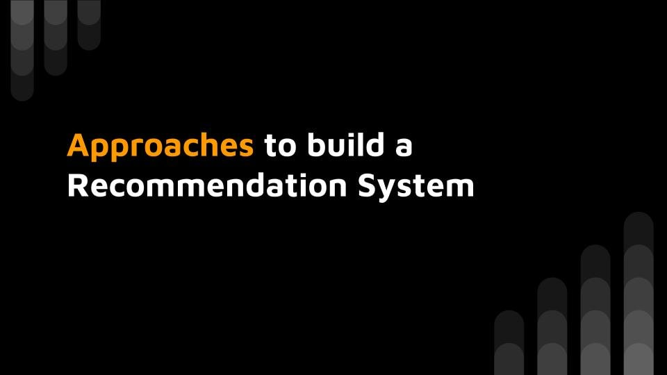

---

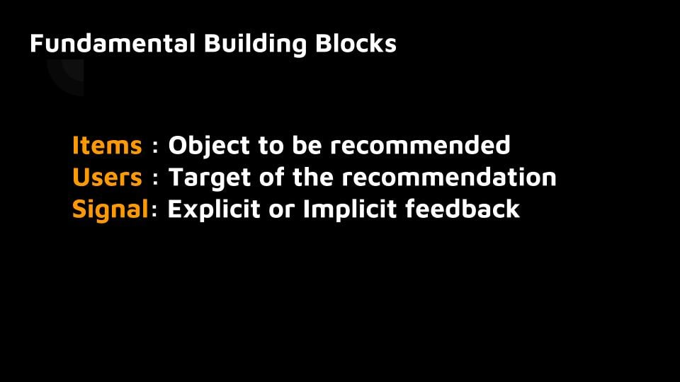

---

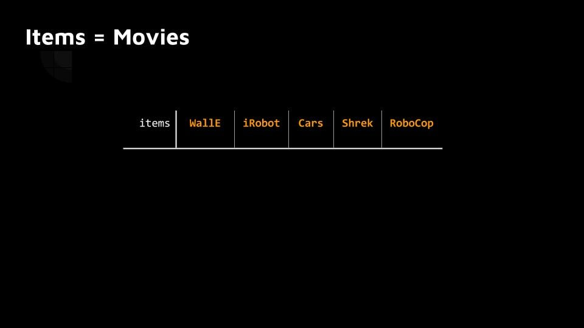

---

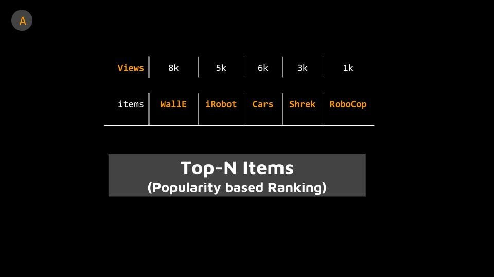

---

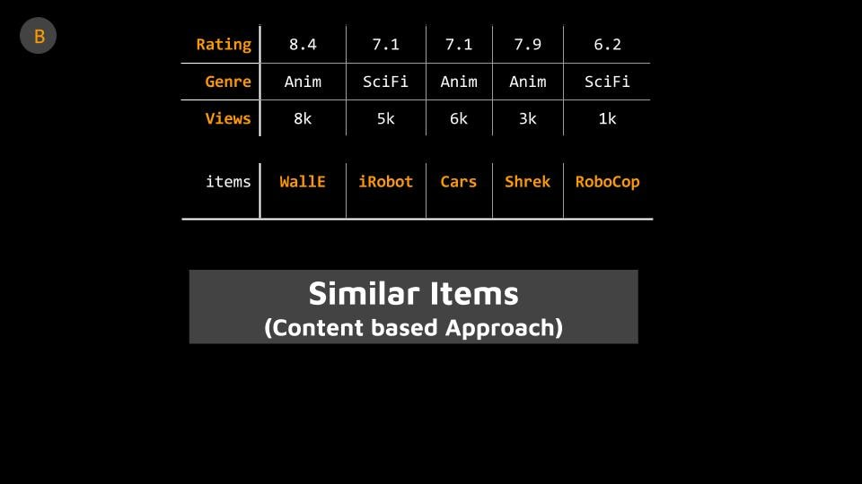

---

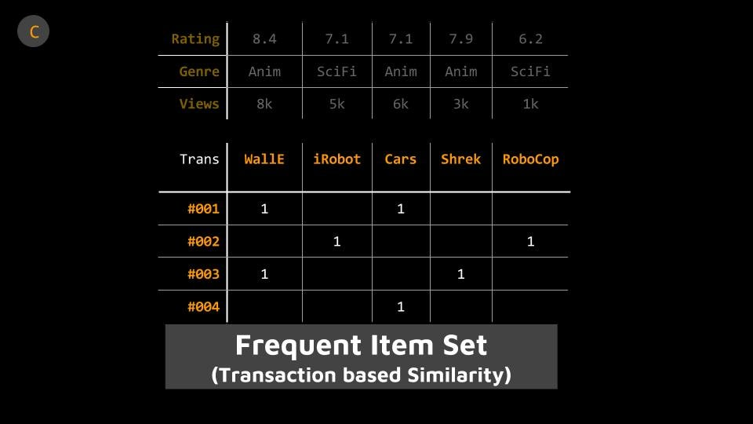

---

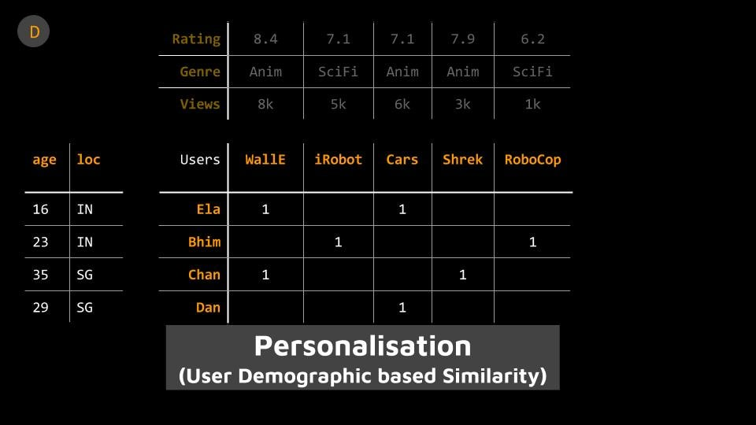

---

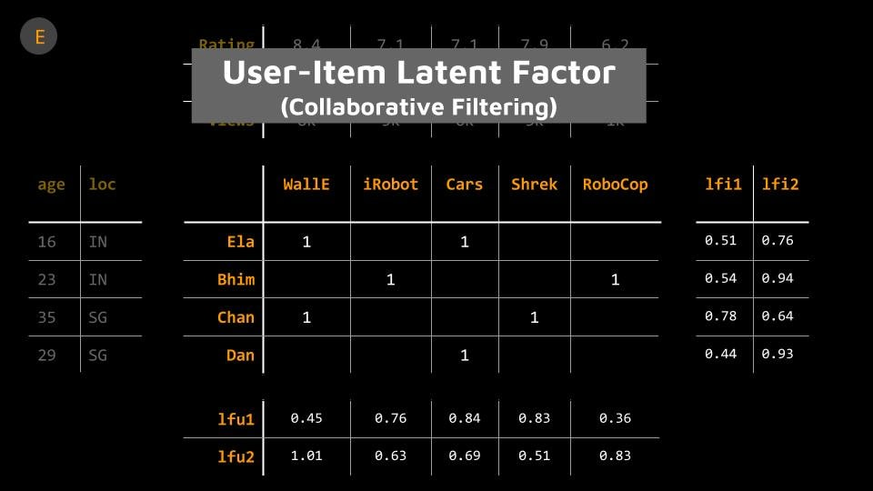

---

---

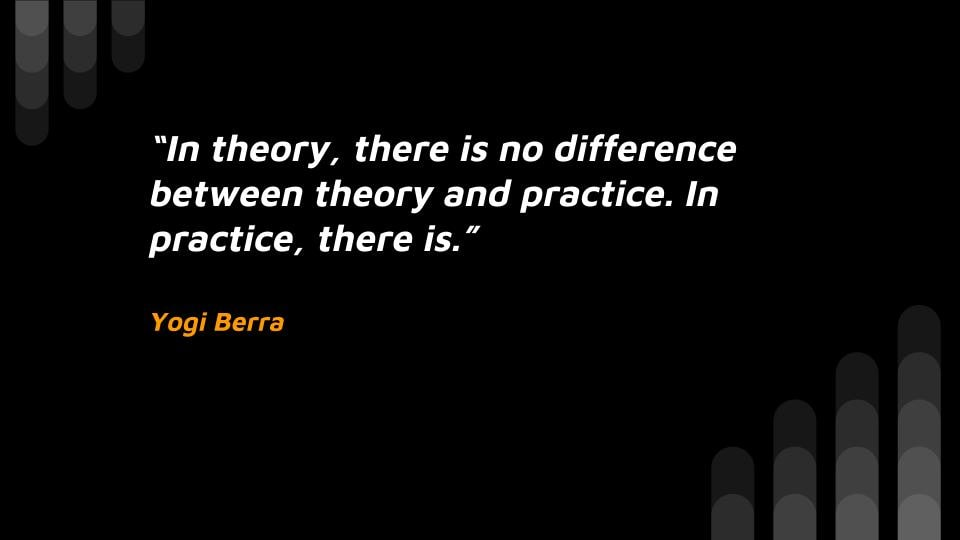

---

---

---

# [fit] Deep Learning Basics
- Basic DL Building Blocks
- Guidance on building & training DL models
- **Exercise**: Simple example for DL

---

# **Exercise: Simple DL**
    
- Introduction to **Keras**: Input, Output, Architecture, Loss, Optimizer
- Build simple DL model: Learning a **Noisy Saddle Curve**

$$ Z = 2X^2 - 3Y^2  + 1 + \epsilon $$

---

# **Exercise: Simple DL Continued**

Experiments with the following:
1. Change activation to *linear* and see whether you can predict the function or not 
2. Change *number of layers* in the network
3. Change *number of learning units* in each layer

---

# **Deep Learning Paradigm**

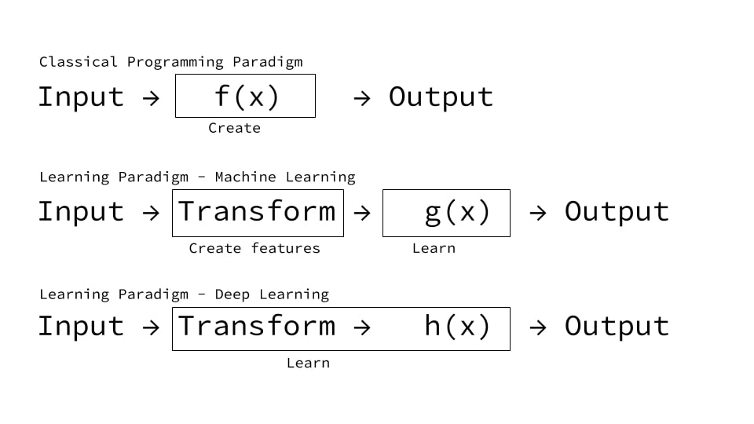

---

# Learning Types & Applications

- **Supervised**: Regression, Classification, ...
- **Unsupervised**: Dimensionality Reduction, Clustering, ...
- **Self (semi)-supervised**: Auto-encoders, Generative Adversarial Network, ...
- **Reinforcement Learning**: Games, Self-Driving Car, Robotics, ...

---

# Example of Supervised Learning
- **Classification**: Image, Text, Speech, Translation
- **Sequence generation**: Given a picture, predict a caption describing it. 
- **Syntax tree prediction**: Given a sentence, predict its decomposition into a syntax tree.
- **Object detection**: Given a picture, draw a bounding box around certain objects inside the picture. 
- **Image segmentation**: Given a picture, draw a pixel-level mask on a specific object.

---

# **Deep Learning Build Blocks**

- **Input**: $$X$$
- **Architecture**: Layers, Learning Units, Weights
- **Output**: $$Y_{predicted}$$ 
- **Loss Function**:$$ Lossf(Y_{predicted}, Y_{actual})$$
- **Optimizer Function** 

---

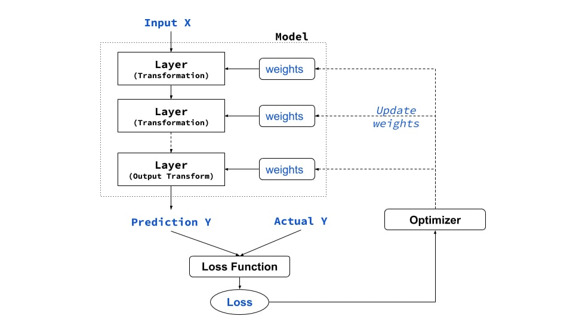

---

# **Data Representation: Tensors**

- Numpy arrays (aka Tensors)
- Generalised form of matrix (2D array)
- Attributes
    - Axes or Rank: `ndim` 
    - Dimensions: `shape` e.g. (5, 3) 
    - Data Type: `dtype` e.g. `float32`, `uint8`, `float64`

---

# **Tensor Types**

- **Scalar**: 0D Tensor
- **Vector**: 1D Tensor
- **Matrix**: 2D Tensor
- **Higher-order**: 3D, 4D or 5D Tensor

---

# **Input $$X$$**

| Tensor | Type     |  Examples    |   Shape | 
|:-------|:---------|:--------------| ---------- | 
| 2D     | Tabular  |  Spreadsheets | (samples, features)   | 
| 3D     | Sequence |  TimeSeries, Text  | (samples, steps, features) |
| 4D     | Spatial  |   Images    | (samples, height, width, channels)    |
| 5D     | Spatial + Sequence   |   Video  | (samples, frames, height, width, channels)    |

---

# **Architecture** 

**Model**
*Sequential*: A linear stack of layers, learnt  in a feed-forward manner

**Layers**
- *Dense Layers*: Fully connected layer of learning units (also called Multi-Layer Perceptron)
- *Basic Layers*: Layers that support basic computation e.g. Flatten, Add, Multiply, DotProduct

---

# **Learning Unit**

$$ y = RELU(dot(w,x) + bias) $$
**weights** are $$ w_1 ... w_n$$ & **activation** is RELU $$ f(z) = max(z,0) $$

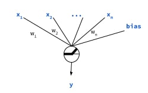

---

# **Output $$Y$$ & Loss**

| $$y$$ |  Last Layer Activation |  Loss Function      |
|:-------|:---------|:----------------------|
| Regression     | None   | Mean Square Error   |
| Regression (0-1)    | sigmoid   | MSE or Binary Cross Entropy   |
| Binary-Class     | sigmoid  | Binary Cross Entropy |
| Multi-Class     | softmax | Categorical Cross Entropy   |
| Multi-Class & Multi-Label     | sigmoid   | Binary Crossentropy    |

---

# **Optimizers**

- **SGD**: Excellent but requires tuning learning-rate decay, and momentum parameters 
- **RMSProp**: Good for RNNs
- **Adam**: Adaptive momentum optimiser, generally a good starting point.

---

# Deep Learning Guidance
> *General guidance on building and training neural networks.*
  

> *Treat them as heuristics (derived from experimentation) and as good starting points for your own explorations.*

---

# **Pre-Processing**
- **Normalize** / **Whiten** your data (Not for text!)
- **Scale** your data appropriately (for outlier)
- Handle **Missing Values** - Make them 0 (Ensure it exists in training)
- Create **Training & Validation Split**
- **Stratified** split for multi-class data
- **Shuffle** data for non-sequence data. Careful for sequence!!

---

# **General Architecture**
- Use **ADAM** Optimizer (to start with)
- Use **RELU** for non-linear activation (Faster  for learning than others)
- Add **Bias** to each layer
- Use **Xavier** or **Variance-Scaling** initialisation (Better than random initialisation)
- Refer to output layers activation & loss function guidance for tasks

---

# **Dense / MLP Architecture**
- No. of units reduce in deeper layer
- Units are typically $$2^n$$
- Don't use more than 4 - 5 layers in dense networks

---

# **CNN Architecture (for Images)**
- Increase **Convolution filters** as you go deeper from 32 to 64 or 128 (Max)
- Use **Pooling** to subsample: Makes image robust from translation, scaling, rotation
- Use **pre-trained models** as *feature extractors* for similar tasks
- Progressively **train n-last layers** if the model is not learning
- **Image Augmentation** is key for small data and for faster learning

---

# **RNN / CNN Architecture (for NLP)**

- **Embedding** layer is critical. **Words** are better than **Characters**
- Learn the embedding with the task or use pre-trained embedding as starting point
- Use BiLSTM / LSTM vs Simple RNN. Remember, RNNs are really slow to train
- Experiment with 1D CNN with larger kernel size (7 or 9) than used for images.
- MLP can work with bi-grams for many simple tasks.

---

# **Learning Process**
- **Validation Process**
    - Large Data: Hold-Out Validation 
    - Smaller Data: K-Fold (Stratified) Validation
- **For Underfitting**
  - Add more layers: **go deeper**
  - Make the layers bigger: **go wider**
  - Train for more epochs: **go longer**

---

# **Learning Process**
- **For Overfitting**
  - Get **more training data** (e.g. actual/augmentation)
  - Reduce **model capacity**
  - Add **weight regularisation** (e.g. L1, L2)
  - Add **dropouts** or use **batch normalization**

---

# [fit] **#3: Collaborative Filtering**

- Core Concept
- Exercise: Build the following 5 models
    - Matrix Factorisation
    - Matrix Factorisation with Bias
    - Non-Negative Matrix Factorisation
    - Deep Matrix Factorisation
    - Neural Collaborative Filtering

---

- Data Transform

---

### Session #4: Collaborative Filtering *(90 mins)*
- **Exercise - Matrix**: Go rate movies 10 movies on the paper or excel sheet.
- **Concept – Interaction:** Linear vs. Non-Linear, Meta Features*(20 mins)*
    - Personalisation
    - Matrix Factorisation: SVD+, ALS & WALS, SGD
    - Including Side Features: LightFM, Keras
    - Loss: RMSE
    - Evaluation: Precision@k, Recall@k
- **Exercise – Item-based Content Model**:  *(50 mins)*
    - Model 3: Matrix Factorisation (SVD
    - Model 4: NNMF
    - Model 5: Neural Matrix Factorisation
    - Model 6: NMF + Meta Features

---

### Session #3: Content Based *(60 mins)*
- **Concept – Case Introduction**: Product Rec *(20 mins)*
    - Item + User MetaData
    - Interaction Features
    - Train & Test Split: Random, Stratified, Chronological
    - Learning: None or feature embeddings
    - Evaluation: Precision@k, AUC
- **Concept – Embedding:** Learning the representation for items*(20 mins)*
    - Exemplar: Pandora: 400 features for each song
    - Item Metadata: Continuous, Categorical, Text (Video, Image, Sound) - for Heterogeneous data
    - Metrics: Dot product, Cosine, ...
    - Evaluation: Precision@k
- **Exercise – Collaborative Filtering**:  *(50 mins)*
    - Baseline: Popularity Based
    - Model 1: Categorical + Sparse Embedding (Text)
    - Model 2: Categorical + Dense Embedding (Pre-trained W2V)
    - Model 3: Auto Encoder

---

### Session #4: Collaborative Filtering *(90 mins)*
- **Exercise - Matrix**: Go rate movies 10 movies on the paper or excel sheet.
- **Concept – Interaction:** Linear vs. Non-Linear, Meta Features*(20 mins)*
    - Personalisation
    - Matrix Factorisation: SVD+, ALS & WALS, SGD
    - Including Side Features: LightFM, Keras
    - Loss: RMSE
    - Evaluation: Precision@k, Recall@k
- **Exercise – Item-based Content Model**:  *(50 mins)*
    - Model 3: Matrix Factorisation (SVD
    - Model 4: NNMF
    - Model 5: Neural Matrix Factorisation
    - Model 6: NMF + Meta Features

---

### Session #5: Learning to Rank *(80 mins)*
- **Exercise - Matrix**: Go rank movies 10 movies on the paper or excel sheet.
- **Concept – Ranking:** Linear vs. Non-Linear, Meta Features*(20 mins)*
    - Ranking vs. Rating
    - Candidate Generation -> Ranking -> Re-ranking
    - Complexity (High number of combinations)
    - Point vs. Pair vs Triplet vs. List
    - Loss: NDCG, 
    - Evaluation: BPR, WARP
- **Exercise – Learning to Rank**:  *(50 mins)*
    - Model 7: ??
    - Model 8: ??

- Set the context for day two sessions
